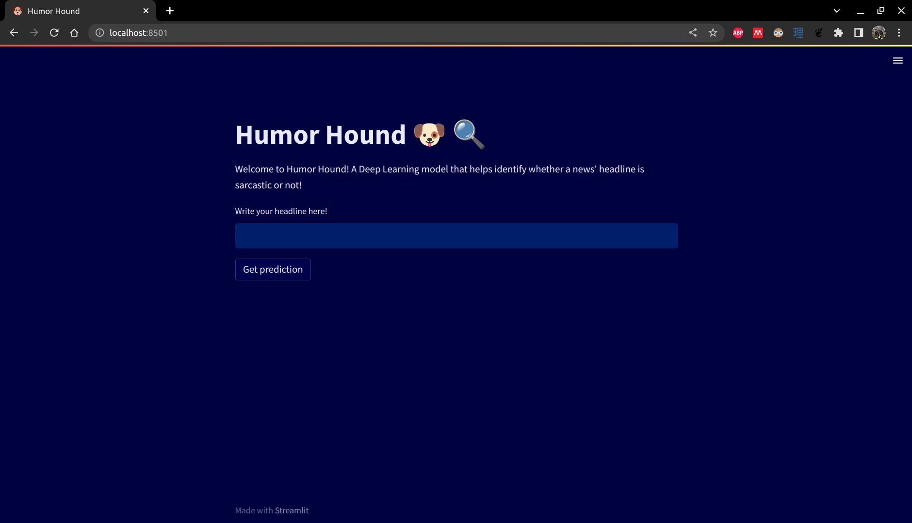
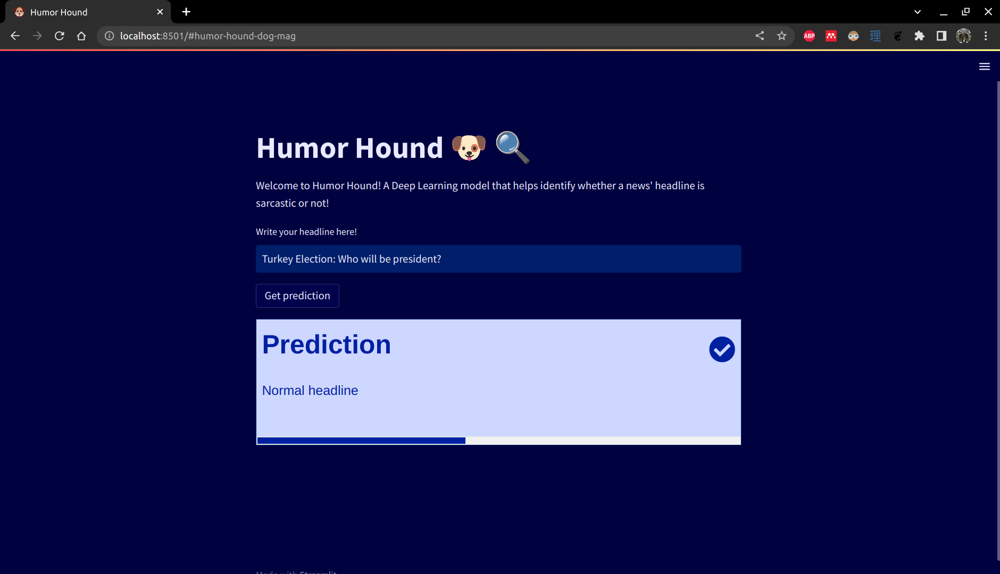
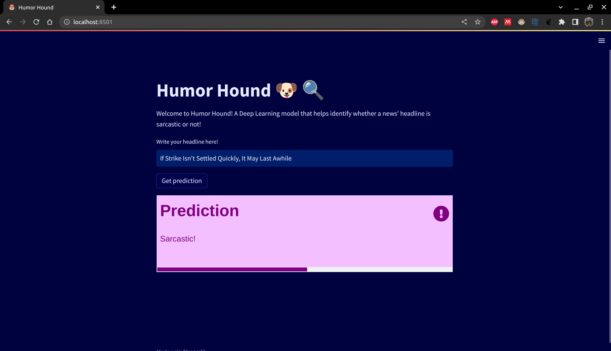

# **Unstructured Data course**

## **Humor Hound**

We present HumorHound, a NLP model that classifies news article titles as sarcastic or not. This project was undertaken as part of the Unstructured Data course within the Big Data Master's Degree program at Comillas ICAI University.

The team responsible for the project includes:

| Name                    | Email                               |
| ----------------------- | ----------------------------------- |
| Jorge Ayuso Martínez    | jorgeayusomartinez@alu.comillas.edu |
| Carlota Monedero Herranz| carlotamoh@alu.comillas.edu         |
| José Manuel Vega Gradit | josemanuel.vega@alu.comillas.edu    |

## **Overview**

Our project aims to develop a classifier that can accurately identify whether a news article title is sarcastic or not. We use a dataset available on [Kaggle](https://www.kaggle.com/rmisra/news-headlines-dataset-for-sarcasm-detection), [1] [2] which consists of news article titles labeled as sarcastic or not.

1. Misra, Rishabh and Prahal Arora. "Sarcasm Detection using News Headlines Dataset." AI Open (2023).
2. Misra, Rishabh and Jigyasa Grover. "Sculpting Data for ML: The first act of Machine Learning." ISBN 9798585463570 (2021).

We explore various natural language processing (NLP) techniques, including feature engineering, word embeddings, and transfer learning. Our goal is to identify the best approach that can help us achieve high accuracy and other evaluation metrics, such as precision, recall, and F1 score. Throughout the project, we continuously monitor the performance of our models and perform error analysis to identify common mistakes.

Our final product, HumorHound, is a user-friendly web application that allows users to enter a news article title and determine whether it is sarcastic or not, using our best-performing model. We provide clear instructions on how to run the application and deploy it to a server.

We believe that our project will provide insights into the challenges of text classification and how to overcome them using various NLP techniques.

## **Interactive App**

In addition to training and testing a wide variety of models, we have also developed a small web application using [Streamlit](https://streamlit.io/). Streamlit is an open-source web framework that allows users to build lightweight web applications to serve Machine Learning and Data Science capabilities using Python. 

However, Streamlit alone does not allow for the creation of REST API endpoints to interact with it, so we also buit a backend to allow for model serving using [FastAPI](https://fastapi.tiangolo.com/lo/).

In addition, we used [Docker](https://www.docker.com/) in order to perform virtualization of these services, so that they can be run in any computer!

To run the application locally, the first step is to [download Docker](https://docs.docker.com/get-docker/) following the OS specifications.

Once Docker is installed, you can run the `run.sh` file on the terminal. This file contains the commands used for building the images and running the containers that contain the apps:

```bash
sudo bash run.sh
```

Once executed, you can run `docker ps` to check that the containers are up an running. 

Finally, to access the UI, head to `http://localhost:8501/`, where you should see a small app that looks like this:



In the UI, you can write any headline you want in the text box and press "Get prediction" to get a prediction on whether the headline tone is sarcastic or not. The bar at the bottom of the info box graphically shows the probability assigned to the model's prediction.




